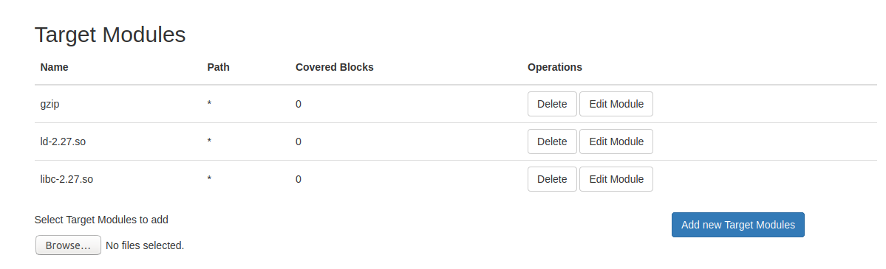
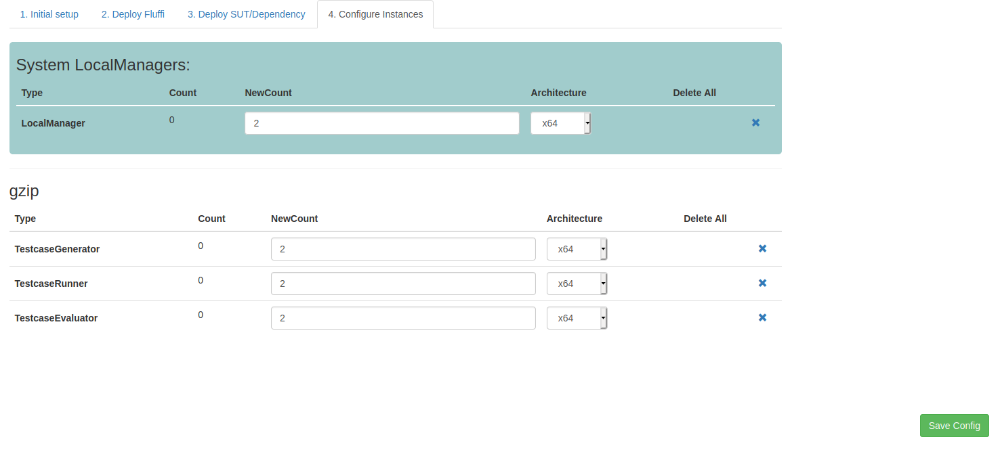

# FLUFFI Beginners Tutorial

## Local Setup with VMware

These instructions assume you have a fresh and clean install of Ubuntu 18.04 and VMware.

### 1. Create VMs

- Create a VM with Ubuntu 18.04 called ubuntu-master and a user "fluffi" with password "fluffi"

- Make sure ubuntu-master has at least 1.5 GB of memory for every core installed

- Create another VM with Ubuntu called ubuntu-runner and a user "fluffi" with password "fluffi"

### 2. Create local FUN network in VMs

- To create a new network in VMware, you need to open the Virtual Network Editor (can be opened from windows search or in VMware)

- Click on "Add Network..." with the following settings (In this case we called it VMnet15):

	

- Next, you will have to add the network we created to your master and runner machine

- Open the Virtual Machine Settings, click on "Add..." and select the Network Adapter as shown below:

	

- Select the custom network (here: VMnet15):

	

- After adding it, your settings should look like this:

	

### 3. Follow the [Getting Started Guide](https://github.com/siemens/fluffi/blob/master/docs/getting_started.md)

- Note that you do not need to customize dnsmasq files and smb files for a local setup with VMs

- You only have to add the credentials "fluffi" to the linux:vars in the hosts file located at FLUFFI/srv/fluffi/data/polenext/projects/1/hosts

- After following the guide and running the containers you should be able to access the fluffi web interface on web.fluffi:8880 on your master machine

- Prepare the runner machine:

```
$ sudo apt update
$ sudo apt upgrade
$ sudo apt install openssh-server
$ hostnamectl set-hostname runner
```

- Test the connection to the master machine on your runner with:
```
$ ping gm.fluffi
```

- Make sure to run the build after the initial build with sudo ./buildAll.sh DEPLOY_TO_FTP=TRUE

- Troubleshooting:
	- When restarting the VM you need to run a restart for networkd again:

	```
	$ sudo systemctl restart systemd-networkd
	```

## Test Fuzzjob with gzip

- Create a text file called population.txt and run:

```
$ gzip population.txt
```

- This will create a zip file called population.txt.gz

- Go to web.fluffi:8880 on your master machine and create a location called testLocation

- Now go to Fuzzjobs > Create Fuzzjob and create a fuzzjob called gzip with the following settings:

	

- Add population.txt.gz file as your population and save the fuzzjob by clicking "FLUFFI FUZZ!" 

- Edit the existing target module by typing in "gzip" as a Module Name and leave the path as it is

- To fuzz gzip, we need to see what libraries gzip uses:

```
$ cd /bin
$ ldd gzip

Output:
linux-vdso.so.1 (0x00007fffce5ab000)
	libc.so.6 => /lib/x86_64-linux-gnu/libc.so.6 (0x00007f999901d000)
	/lib64/ld-linux-x86-64.so.2 (0x00007f9999677000)
```

- The first one (linux-vdso.so.1) is not relevant because it is a virtual library that is automatically mapped in the address space of a process by the kernel, see vdso(7).

- Now we have to dig deeper about linked files of libc.so.6:

```
$ ls -ahl /lib/x86_64-linux-gnu/libc.so.6

Output:
lrwxrwxrwx 1 root root 12 Dec  7 08:38 /lib/x86_64-linux-gnu/libc.so.6 -> libc-2.27.so
```

- Add the file /lib/x86_64-linux-gnu/libc-2.27.so as a target module in your fuzzjob gzip.

- We will do the same procedure for the last file ld-linux-x86-64.so.2:

```
$ ls -ahl /lib64/ld-linux-x86-64.so.2

Output:
lrwxrwxrwx 1 root root 32 Dec  7 08:38 /lib64/ld-linux-x86-64.so.2 -> /lib/x86_64-linux-gnu/ld-2.27.so
```

- Add the file /lib/x86_64-linux-gnu/ld-2.27.so as a target module in your fuzzjob gzip.

- Now your Target Modules should look like this:
	

- Go to http://web.fluffi:8880/systems on your master machine
- Remove the dummy windows and linux machines by deleting them in the systems view
- Add your runner machine by clicking on "Add System" and type in the hostname "runner" and select "Linux"
- After adding your runner machine, a periodic task called checkHostsAlive which is executed every 5 minutes should detect it
- Refresh the systems view in the web gui after 5 minutes and check the Status for your machine "runner" under the Group "Linux"
- If the Status is OK, you can click on the hostname "runner" and click on "Start Setup" (URL: http://web.fluffi:8880/systems/view/runner/linux)
- This will redirect you to polemarch:
	- Go to the History and see if the task was OK
- Now you can go back to your runner machine in the systems view (http://web.fluffi:8880/systems/view/runner/linux) and deploy it with the architecture x64
- Lastly, go to step 4. Configure Instances in the systems view and add LocalManagers, Generators, RUnners and Evaluators as shown below:
	
	- and click on "Save Config"
